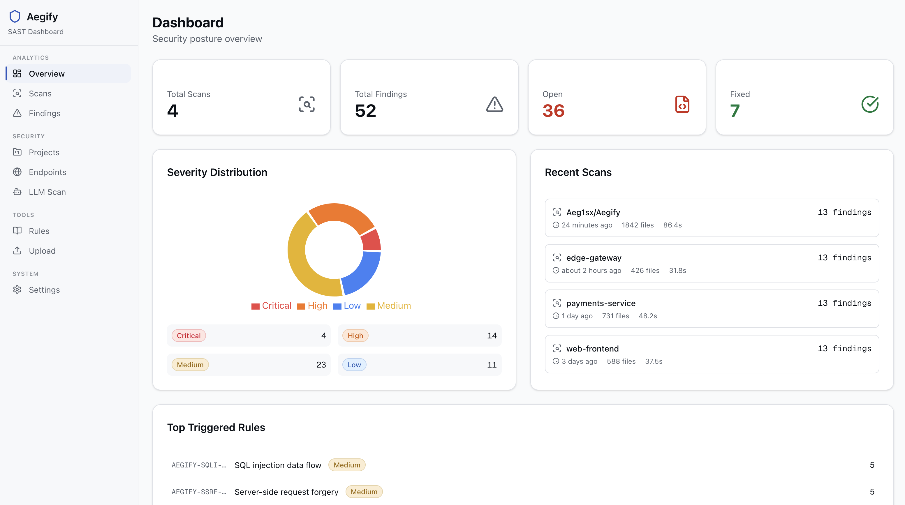
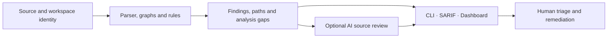

# Aegify

[](https://github.com/Aeg1sx/Aegify/actions/workflows/ci.yml)
[](LICENSE)

**Source security analysis with traceable evidence, optional AI investigation, and a self-hosted team workspace.**

Aegify connects source code, call paths, data flow, and findings so reviewers can
see why a result was raised and what still needs investigation. Run the same
Python scanner locally, in CI, or through the dashboard. Add AI review when you
need source-grounded triage and remediation suggestions.

[Quickstart](docs/quickstart.mdx) · [Documentation](docs/index.mdx) ·
[Releases](https://github.com/Aeg1sx/Aegify/releases) ·
[Quality assessment](QUALITY_ASSESSMENT.md) · [Security policy](SECURITY.md)

> **Release track: team self-hosting beta.** The proposed first release is
> `v0.3.0-beta.1`. Use it for evaluated internal deployments with human review.
> Detection coverage, live AI-provider behavior, and operational performance
> still have acceptance gaps. The [release notes](docs/releases/v0.3.0-beta.1.md)
> define the scope; the Releases page is authoritative for publication status.



*Dashboard preview with demo scan data.*

## What you can do

| Workflow | Included capabilities |
|---|---|
| **Scan code and inspect evidence** | Eight-language AST parsing, bounded interprocedural taint, call graphs, source locations, analysis gaps, JSON and SARIF output |
| **Understand larger applications** | Repository-qualified identity, multi-repository workspaces, SCIP import, JVM classpath/bytecode evidence, Spring models, endpoint and frontend/Gateway correlation |
| **Review findings with AI** | Optional API, Codex and Claude Code adapters; six-role CLI pipeline; bounded source list/search/read tools with citations and retained evidence |
| **Work as a team** | Project roles, expiring project CI tokens, source scan and AI review queues, cancellation/recovery, finding history, assignment, due dates, tags and audit events |
| **Develop rules** | YAML rule audit, project Rule lab, positive/negative fixtures, real scanner previews and exports reproducible in the CLI |
| **Operate an internal installation** | Containerized workers, encrypted retained AI evidence, database migrations, encrypted backups and restore controls |

The dashboard's durable finding investigations and the six-role CLI source loop
are separate workflows. The CLI loop does not yet checkpoint each turn or resume
after a crash. See the [agent contract](docs/concepts/security-agents.mdx) and
[AI review workflow](docs/analysis/ai-sast-operations.mdx).

## Run your first scan

Requires **Python 3.14+** and **uv 0.12.18**. From a reviewed checkout:

```bash
git clone https://github.com/Aeg1sx/Aegify.git
cd Aegify
uv sync --locked --project scanner

# Verify installation and bundled rules.
uv run --project scanner --locked aegify version
uv run --project scanner --locked aegify audit-rules ./rules --strict

# Scan without a model call and retain the evidence for later review.
uv run --project scanner --locked aegify scan /path/to/repository   --no-llm --output json --output-file scan.json

# Export a scan as SARIF for GitHub, an editor, or the dashboard.
uv run --project scanner --locked aegify scan /path/to/repository   --no-llm --output sarif --output-file results.sarif
```

The default branch is a development checkout. For a release installation, select
a published tag from [Releases](https://github.com/Aeg1sx/Aegify/releases) before
synchronizing dependencies. Release assets include a scanner wheel, SBOM,
checksums and provenance attestations; see the [release notes](docs/releases/v0.3.0-beta.1.md)
for verification and installation. A GitHub release does not imply a PyPI release.

| Scan exit code | Meaning |
|---|---|
| `0` | Analysis completed with no high/critical blocking finding |
| `1` | High/critical blocking finding present |
| `2` | Scan failed |
| `3` | Analysis is partial; inspect the reported gaps |

An empty result from a failed or partial scan is not a clean security result.
Upload failure has its own exit code, `4`.

### Add optional AI investigation

```bash
# Review the retained artifact without contacting a model.
uv run --project scanner --locked aegify agent-run scan.json   --mode deep --output-file agent-run.json

# Use an authenticated, operator-isolated Codex installation for source review.
uv run --project scanner --locked aegify agent-run scan.json   --provider codex --workspace /path/to/repository --source-tools   --max-agent-rounds 4 --max-agent-tools 12 --output-file agent-source-review.json
```

API providers and Claude Code use the same structured review contract. Source
reads must match the saved scan's file hashes. Missing sources, incomplete
citations or exhausted limits remain visible as partial results. AI suggestions
do not change human triage or establish exploit impact. Configure provider data
boundaries and CLI isolation using the [provider guide](docs/operations/ai-providers.mdx).

### Start a team workspace

Follow [authentication setup](docs/operations/authentication.mdx) to configure
separate authentication/encryption secrets, an identity provider or verified-email
password sign-in, an admission allowlist, administrator identities and the public
URL. Then start the single-host installation:

```bash
docker compose up -d --build dashboard worker ai-worker
docker compose ps
```

Create a project, assign roles, and use **Start source scan** to run the Python
engine through the source worker. Optional AI reviews run in their own worker.
The **Rule lab** evaluates saved rule fixtures with the same engine.

For CI uploads, issue an expiring token inside the project and provide it as
`AEGIFY_UPLOAD_TOKEN` in the runner:

```bash
uv run --project scanner --locked aegify upload results.sarif   --dashboard-url https://your-dashboard.example
```

This is one internal installation with project-level authorization. Hosted tenant
isolation and multi-host availability are outside the beta contract. Configure
[worker operations and upgrades](docs/operations/self-hosted-workers.mdx) and
[backup/restore](docs/operations/backup-recovery.mdx) before retaining team data.

## Analysis coverage and measured quality

| Language | AST and bounded taint | Endpoint extraction families |
|---|:---:|---|
| Python | Yes | Flask, FastAPI, Django |
| JavaScript | Yes | Express |
| TypeScript | Yes | Express, NestJS, Next.js App Router |
| Java | Yes | Spring MVC/WebFlux annotations |
| Kotlin | Yes | Spring MVC/WebFlux annotations, Ktor |
| Go | Yes | net/http, Gin, Echo, Fiber, Chi, Gorilla |
| Rust | Yes | Actix Web, Axum, Rocket |
| Swift | Yes | Vapor, Hummingbird |

These entries describe parser-backed contracts and modeled patterns. They do not
promise complete framework or language coverage. Dynamic routes, reflection,
generated code, unmodeled libraries and conservative control-flow handling can
leave gaps. See the [technical architecture](docs/architecture/technical-architecture.mdx)
and [semantic analysis contract](docs/analysis/semantic-analysis.mdx).

The latest retained public OWASP Benchmark Python measurement scored **1,193
cases**: **68.37% precision**, **49.31% recall** (214 TP, 99 FP, 220 FN, 660 TN).
Another 37 CWE-501 cases are unscored, so the overall evaluation remains partial.
This is a public synthetic case/CWE evaluation, not an independent application
holdout or a precision estimate for every emitted finding.
[Corpus, provenance and replay instructions](scanner/benchmarks/sql-expressions-v1/README.md).

The separate owned `core-v1` corpus has 9 TP, 0 FP and 0 FN across five scoped
rules. Its passing gate does not generalize to whole-product accuracy. Current
regression evidence, benchmark limits and release blockers are recorded in the
[quality assessment](QUALITY_ASSESSMENT.md).

## Evidence and CI



Candidate, statically reachable, runtime observed and impact proven are distinct
evidence states. Severity describes potential impact; **disposition** determines
whether a finding can block CI. Broad heuristics remain advisory. Taint and
structured semantic evidence can produce blocking findings, but still require
review. [Read the evidence contract](docs/concepts/evidence-gates.mdx).

```yaml
name: Aegify
on: [pull_request]
jobs:
  scan:
    runs-on: ubuntu-latest
    permissions:
      contents: read
      security-events: write
    steps:
      - uses: actions/checkout@3d3c42e5aac5ba805825da76410c181273ba90b1
        with:
          persist-credentials: false
      # Replace with the reviewed full commit SHA for your selected release.
      - uses: Aeg1sx/Aegify@FULL_40_CHARACTER_COMMIT_SHA
        with:
          llm-enabled: "false"
          upload-sarif: "true"
```

## Development and next priorities

```bash
uv sync --locked --project scanner --extra dev
uv run --project scanner --locked pytest scanner/tests
uv run --project scanner --locked ruff check scanner/src scanner/tests
uv run --project scanner --locked mypy --strict scanner/src/aegify
uv run --project scanner --locked aegify audit-rules ./rules --strict
```

For dashboard and documentation checks, see [CONTRIBUTING.md](CONTRIBUTING.md).
The main development priorities are independently reviewed evaluation data and
false-positive/false-negative reduction, live-provider acceptance, durable
six-role agent execution, and measured installation recovery/performance.
The [commercial-readiness ledger](docs/project/commercial-readiness-plan.md)
tracks their evidence and remaining work.

| Directory | Purpose |
|---|---|
| `scanner/` | Python scanner, graphs, rules, agents, benchmarks and tests |
| `dashboard/` | Team UI, APIs, workers and database migrations |
| `rules/` | Bundled YAML rule definitions |
| `docs/` | English/Korean documentation and release notes |
| `.github/` | CI, code scanning, repository rules and release workflow |

Contributions follow [the contribution guide](CONTRIBUTING.md) and
[governance](GOVERNANCE.md). For support, see [SUPPORT.md](SUPPORT.md).
Report vulnerabilities through [SECURITY.md](SECURITY.md).

## License

[MIT](LICENSE)
