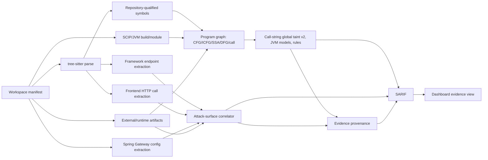
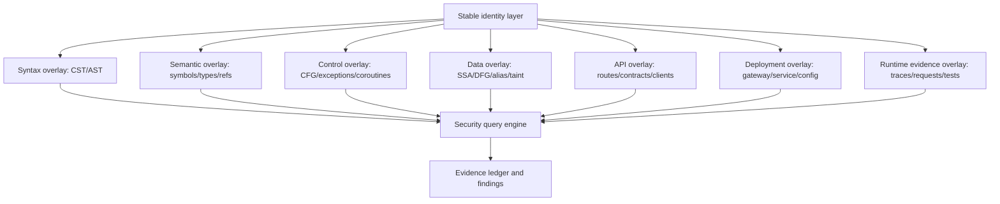
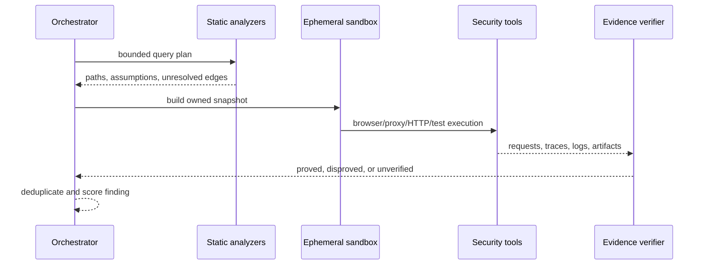

# CodeGuard 기술 아키텍처와 고도화 기준

기준일: 2026-08-22

## 결론

CodeGuard는 현재 **멀티 언어 구조 분석, 정규화 Program Graph, bounded global taint, API 엔드포인트 및 프론트엔드·Spring Cloud Gateway·런타임 상관 분석**에 SCIP/JVM/Spring 의미 계층과 정책 제한 Docker 검증 하네스를 결합한 alpha 화이트박스 SAST입니다. branch/loop/switch/when 및 보수적 try/catch/finally CFG, call-site를 보존하는 source-bounded call/return ICFG, 검증된 compiler-classpath JAR의 source→bytecode→invoke 및 선언 예외 ICFG, callsite stack 기반 bounded context-balanced query, reaching-def DFG, SSA phi, k=2 context-bounded JVM source allocation/alias/points-to overlay, descriptor-safe Java/Kotlin overload와 flow-sensitive local·field access path·allocation-site object·argument/receiver/scalar 및 object return taint 고정점 분석, singleton allocation field strong update, k=2 call-string 호출 컨텍스트와 버전된 JVM library model pack은 구현됐지만, Joern/CodeQL과 동등한 runtime/implicit exception-complete interprocedural CFG, source+bytecode exhaustive heap points-to, IFDS/IDE tabulation을 주장하지 않습니다.

이번 정비에서 멀티 레포 충돌 방지와 strict-zero 룰 DSL에 이어 **SCIP 수입·격리 생성, 함수 범위 SCIP occurrence, JVM module/CHA/RTA, Maven/Gradle artifact·lock·version-catalog resolver, k=2 context-bounded source points-to, 승인 기반 compiler-classpath exporter와 direct/virtual/interface bytecode CHA, `NEW` 기반 allocation-aware RTA, LambdaMetafactory/altMetafactory `invokedynamic`, component/`@Bean`·qualifier/primary·conditional·module/provider-scoped Spring DI v2, Security/transaction/coroutine/Reactor, Program Graph, call-string global taint v2, JVM model pack, CodeQL/Semgrep/Joern adapter, HTTP/HAR/OpenTelemetry runtime evidence**까지 추가했습니다. 다음 정밀도 관문은 source+bytecode unified points-to, IFDS/IDE, generic/custom bootstrap 및 model coverage 확대입니다.

## 현재 구현의 정확한 범위

| 영역 | 현재 상태 | 판정 |
|---|---|---|
| CST/AST | tree-sitter로 8개 언어를 전체 파일 단위 파싱 | 동작, 증분 파싱은 미사용 |
| 심볼 ID | 워크스페이스에서 `repo:{repo}:{module}::{symbol}` 사용 | 레포 간 이름 충돌 방지 |
| 호출 그래프 | call-site별 MultiDiGraph, descriptor-safe source call + JVM CHA/RTA + k=2 source points-to + Spring DI v2 + verified bytecode direct/virtual/interface CHA, allocation-aware RTA, LambdaMetafactory/altMetafactory dynamic target overlay | 반복 caller/callee edge, Java/Kotlin overload, 상속/default method dedup, 복수 override CHA, alias/factory-return/caller-context별 receiver 축소, `NEW` 기반 RTA 부분집합, lambda/method reference, qualifier/primary/conditional bean과 exact module/provider scope 동작; CHA는 보존하며 generic, 활성 Spring condition 평가, source+bytecode unified receiver narrowing과 non-Lambda custom bootstrap 의미는 제한 |
| SCIP | repo별 복수 index, 격리 `scip-java index`, exact package-version resolver, content-addressed import shard cache | 동작, compiler-index 생성 cache는 제한 |
| JVM build | Maven/Gradle build/module/source-root discovery, Maven property/dependency-management, Gradle literal/default version catalog/lockfile, exact workspace provider-module graph, 승인 기반 offline classpath exporter, deterministic bundle, strict SHA-256 snapshot/JAR/classfile import | 동작, Maven BOM·custom catalog/convention plugin은 제한 |
| CFG/SSA/DFG | 함수별 분기/loop/break/continue, switch/when, try/catch/finally CFG, call statement→callee entry 및 callee exit→정상 continuation ICFG, bytecode call/return 및 declared exception→caller catch ICFG, callsite push/pop bounded context-balanced query, reaching-def, SSA phi | source/verified-bytecode bounded 동작; mismatched return 배제와 recursion/state limit exhaustion 명시, runtime/implicit exception-complete CFG는 제한 |
| Program Graph | AST, CFG/ICFG, DFG, SSA, data-state transformation, call, context-bounded JVM source points-to/alias, taint, semantic, framework, API/runtime overlay | query/export와 callsite SHA evidence/counter 동작, Joern 전체 CPG 호환을 주장하지 않음 |
| taint | flow-sensitive local, field access path, allocation-site object, argument/receiver/scalar return, callee object-return identity, singleton allocation field strong update, k=2 call string, sink-category sanitizer 고정점 전파 | object-return caller 격리와 안전 overwrite 부정 회귀 통과; ambiguous alias는 weak update, IFDS/IDE와 source+bytecode unified heap은 제한 |
| JVM model pack | strict schema `2026.08.1`, source/sink/propagator/sanitizer 9개 모델 | SARIF에 버전·적용 수 보존, library coverage는 제한 |
| Java/Kotlin | AST, 구조 call 및 Kotlin grammar-error bounded member-call recovery, endpoint, component/`@Bean` DI, qualifier/primary/condition, security, transaction, suspend/Reactor | source model 동작, reflection 및 활성 profile/property/custom condition 평가는 제한 |
| Spring Gateway | YAML과 단순 `RouteLocator` DSL의 Path/Method/filter 추출 | 정적 설정 근거 제공 |
| 프론트엔드 | `fetch`, axios 계열, 일반 HTTP client 호출 경로 추출 | 문자열/템플릿 중심, 타입 기반 아님 |
| 공격 표면 | frontend/gateway/runtime source와 backend endpoint를 confidence/provenance와 함께 연결 | 정적 및 관측 evidence 구분 |
| Evidence identity | 소스·OpenAPI·Gateway 입력 snapshot, analyzer/rule digest, stable evidence ID | finding/attack edge/SARIF/DB에 보존 |
| 외부 도구 | CodeQL/SARIF, Semgrep JSON, Joern JSONL/GraphSON import | bounded import 동작, 도구 설치/실행 job은 외부 |
| 동적 검증 | digest-pinned/no-network Docker, output 보존/hash, loopback HTTP runner | 동작, live container smoke는 daemon 필요 |
| 런타임 증거 | active loopback Playwright, active loopback proxy mutation, browser/proxy HAR, HTTP/proxy evidence v1, OpenTelemetry trace-parent import | 동작, 인증 비밀/TLS MITM/multi-origin egress는 미허용 |
| AI 검증 | LLM finding review 및 remediation | 정적 근거 보조, exploit proof 아님 |
| 룰 DSL | 311개 정의 중 303개 enabled/executable, 8개 reference-only disabled | strict audit 0 error/0 warning |

## 구현된 분석 흐름



상관 분석은 다음 사실을 구분해 보존합니다.

- `calledByFrontend`: 스캔한 JS/TS 코드에서 일치하는 호출 근거가 있음
- `exposedViaGateway`: 스캔한 Gateway 설정에서 일치하는 public route 근거가 있음
- `runtimeObserved`: HTTP/HAR/trace artifact에서 method/path 관측 근거가 있음
- `matchKind`: exact, template, gateway pattern, gateway transform 중 어떤 방식으로 연결했는지
- `confidence`: 동적 URL, 템플릿, rewrite 등 불확실성을 반영한 신뢰도
- `workspaceSnapshot`: source, OpenAPI, Gateway 설정을 경로 독립적으로 해시한 입력 identity
- `evidenceId`: snapshot, producer, rule/edge identity, repository/module/source range로 만든 재현 가능한 ID

근거가 없다는 사실은 “사용되지 않음”이나 “외부에서 접근 불가”를 뜻하지 않는다. 모바일 앱, 다른 서비스, 외부 고객, 런타임 등록 라우트는 현재 입력에 없을 수 있다.

## 목표 보안 그래프 IR

CPG 하나에 모든 의미를 억지로 넣기보다, 공통 identity 위에 typed overlay를 쌓는 구조가 적합합니다.



### 노드 identity

최소 identity는 다음 튜플로 고정합니다.

```text
workspace_snapshot
repository_id
commit_sha
module/build_target
language
semantic_symbol
source_range
```

소스 경로와 짧은 함수명만으로 identity를 만들면 멀티 레포, overload, Kotlin extension, generated source에서 충돌합니다. 현재 source fallback도 repository/module-qualified ID에 정규화 parameter descriptor를 포함하고, SCIP가 있으면 compiler symbol을 canonical identity로 사용합니다.

### overlay와 provenance

모든 edge에는 `producer`, `producer_version`, `confidence`, `snapshot`, `evidence_location`을 둡니다. 예를 들어 call edge는 `scip-java`, `CHA`, `RTA`, `tree-sitter-heuristic`, `runtime-trace` 중 어떤 분석기가 생성했는지 구분해야 합니다. 여러 분석 결과가 충돌하면 덮어쓰지 않고 병렬 evidence로 유지합니다.

## 기술 선택

### tree-sitter

빠른 구문 계층과 컴파일 불가능한 PR의 fallback에 사용합니다. tree-sitter는 편집된 tree를 재사용하는 증분 파싱과 구조 공유를 지원하지만, 현재 구현은 파일마다 새로 파싱합니다. 데몬형 인덱서에서 old tree cache를 붙여야 “증분”이라고 부를 수 있습니다.

### SCIP

멀티 레포 심볼 정의·참조·구현과 외부 패키지 identity의 기본 계층으로 적합합니다. Java/Kotlin은 `scip-java` 같은 컴파일러 기반 인덱서를 우선하고, 빌드가 실패할 때 tree-sitter fallback을 사용합니다. SCIP 자체는 데이터흐름이나 취약점 엔진이 아니므로 CPG/DFG를 대체하지 않습니다.

### CPG와 CodeQL

Joern식 CPG는 AST, CFG, intra-procedural dataflow를 하나의 directed attributed multigraph와 overlay로 다루는 깊은 보안 분석 계층입니다. 직접 재구현하기 전에 다음 adapter 전략을 사용합니다.

1. Joern/CodeQL/Semgrep 결과를 공통 Security Graph IR로 import
2. 자체 프레임워크 모델과 API/deployment overlay를 결합
3. 그래프 쿼리 결과를 동일 evidence ledger 형식으로 변환
4. 정확도와 비용이 검증된 분석만 점진적으로 내재화

Java/Kotlin에는 local/global dataflow, call target, library summary가 필요합니다. CodeQL이 Java와 Kotlin에 공통 라이브러리를 제공하더라도 Kotlin은 bytecode 표현 차이 때문에 query가 항상 동일하게 동작하지 않는다는 점을 모델 테스트에 반영해야 합니다.

### DTG, TEG, LARA의 위치

- DTG는 2025년 말 제안된 자동 프로그램 수리 연구의 repository-scale data transformation 표현입니다. 일반 SAST에서 CPG를 대체한다는 검증 결과로 해석하지 않습니다.
- TEG는 2026년 Defects4J Java 프로그램 수리 연구에서 런타임 trace를 압축해 CPG와 결합한 표현입니다. 보고된 94.85%, 55.97% 축소율은 그 실험 파이프라인의 값입니다.
- LARA는 CPG source-to-sink 경로를 LLM이 점수화하는 neuro-symbolic 접근이지만 공개 평가가 Log4Shell 중심이며 수동 검증 루프를 포함합니다.

따라서 세 기술은 core truth layer가 아니라 다음 단계의 **실험적 evidence/query overlay**로 둡니다. 먼저 SCIP/타입/CFG/DFG와 런타임 trace 수집의 신뢰성을 확보해야 합니다.

현재 Program Graph에는 정의마다 `data-state` 노드를 만들고, reaching definition을
입력 상태에서 새 정의 상태로 연결하는 `transforms` edge를 추가했다. 이는 DTG 연구의
data-lineage 관점을 적용한 bounded source overlay이지 논문의 전체 repair agent나
동등 구현을 주장하는 것은 아니다. OpenTelemetry `trace-parent`와 runtime endpoint
edge는 TEG 계열 실험이 사용할 수 있는 실행 증거층이다.

## Java, Spring, Kotlin 심층 분석 설계

### 빌드와 타입 환경

- [구현] Maven/Gradle multi-module 구조, Maven property, 기본 Gradle version catalog와 dependency lock coordinate 수집
- JDK, Kotlin compiler, 실제 classpath, generated source, annotation processor를 snapshot metadata로 저장
- [구현] Spring Boot profile/conditional bean을 조건 원문이 붙은 가능한 상태 집합으로 모델링; 실제 환경 값 평가는 후속
- compile 성공 시 SCIP/compiler symbol, 실패 시 tree-sitter symbol을 사용하고 결과에 fidelity를 표시

### 호출 그래프

단계별로 정밀도를 올립니다.

1. CHA로 가능한 virtual dispatch 후보 계산
2. source 생성식과 검증된 bytecode `NEW`로 RTA 후보를 별도 계산하되 CHA 증거 보존
3. [구현] k=2 source points-to 분석으로 allocation/alias/argument/return별 receiver 후보 축소
4. Spring DI binding, `@Bean`, component scan, proxy/AOP edge overlay
5. reflection, serialization, SpEL, method handle은 unresolved dynamic edge로 보존
6. Kotlin extension, suspend state machine, inline, default parameter bridge, nullability를 source symbol에 역매핑

불확실한 호출을 하나로 단정하지 않고 candidate edge 집합과 근거를 저장합니다.

### 제어·데이터 흐름

- [구현] 반복 호출과 descriptor target을 보존하는 source-bounded call/return ICFG; caller exception continuation은 정상 return edge에서 제외
- [구현] 검증된 classpath bytecode call/return과 classfile 선언 예외를 caller catch/uncaught continuation에 연결
- [구현] source/bytecode normal·declared-exception edge의 callsite stack-balanced bounded query; depth/state limit 소진은 명시적 오류
- runtime/implicit library exception과 resource lifecycle을 포함하는 정밀 CFG로 승격
- SSA 또는 동등한 def-use 표현
- field/heap/object-sensitive alias 분석의 선택 가능한 정밀도
- 현재 k=2 call-string bounded global solver 위에 IFDS/IDE 계열 tabulation 또는 검증된 외부 엔진 결합
- [구현] source, sink, sink-category sanitizer, propagator를 strict/versioned JVM model pack으로 분리; framework/library coverage는 지속 확대
- WebFlux/Reactor의 `Mono`/`Flux`, callback, coroutine context 전파 모델

### Spring 의미 모델

다음 요소가 endpoint annotation regex보다 우선되어야 합니다.

- MVC/WebFlux annotation route와 class-level prefix 조합
- functional router (`RouterFunction`), servlet/filter chain
- `@PreAuthorize`, `@Secured`, Spring Security matcher 및 filter order
- controller → service → repository → ORM/JDBC/HTTP client 경로
- validation, Jackson binding, mass assignment, SpEL, template, redirect, file handling
- Feign, RestClient, WebClient, OkHttp를 service-to-service API edge로 연결
- Spring Cloud Gateway의 Path/Method/Host/Header predicate와 RewritePath, StripPrefix, PrefixPath, SetPath 모델

## 멀티 레포 실행 모델

워크스페이스 manifest는 단순 경로 목록이 아니라 재현 가능한 snapshot 계약으로 확장합니다.

```yaml
version: 1
name: commerce
repositories:
  - id: web
    path: ../web
    commit: 0123456789abcdef
    role: frontend
  - id: gateway
    path: ../gateway
    commit: fedcba9876543210
    role: gateway
  - id: orders
    path: ../orders
    commit: aabbccddeeff0011
    role: service
```

인덱스 shard cache key는 `repository + commit + build target + compiler + dependency graph + analyzer version`으로 구성합니다. 공통 라이브러리 변경 시 dependency graph를 따라 영향받는 shard만 무효화합니다. 레포 간 edge는 패키지 좌표, API contract, gateway route, client call, service discovery 이름을 evidence로 사용합니다.

## AI 분석 및 동적 검증 하네스

Strix/Shannon과 비슷한 운영 완성도를 내려면 “LLM이 코드를 읽는 기능”보다 검증 하네스가 중요합니다.



필수 통제는 다음과 같습니다.

- 분석 대상, 네트워크 egress, credential, 시간, CPU/메모리, 요청 수의 policy gate
- repo별 빌드 컨테이너와 read-only source mount
- Semgrep/CodeQL/Joern/ZAP/Nuclei 등 도구 adapter의 버전·명령·출력 hash 기록
- 브라우저, HTTP proxy, 테스트 trace를 endpoint/call/dataflow edge에 연결
- “정적 후보”, “동적 도달 확인”, “악용 영향 증명”을 별도 상태로 관리
- PoC는 소유 fixture 또는 승인된 테스트 환경에서만 실행
- LLM 결론이 아니라 원본 request/response, stack trace, graph path가 finding의 근거

## 공격 표면 데이터 모델

엔드포인트별 상태는 최소 다음과 같이 나눕니다.

| 상태 | 의미 |
|---|---|
| frontend-observed | 스캔한 UI 코드에 client call 근거가 있음 |
| gateway-exposed | Gateway predicate/filter로 public path가 연결됨 |
| runtime-observed | HTTP/HAR/trace에서 endpoint 도달이 관측됨 |
| service-to-service | Feign/WebClient/contract consumer가 연결됨 |
| contract-only | OpenAPI에는 있으나 handler 또는 caller를 연결하지 못함 |
| backend-only | handler만 있고 현재 입력에서 caller/gateway 근거가 없음 |
| unresolved-dynamic | 런타임 URL, reflection, service discovery 때문에 정적 연결 불가 |

향후 UI는 endpoint 목록뿐 아니라 `frontend page → client call → gateway public route → backend handler → downstream call → sink` 경로를 보여주고, 각 edge를 클릭하면 파일·라인·설정·trace를 확인할 수 있어야 합니다.

## 품질 게이트와 로드맵

### P0: 오픈소스 정직성 및 재현성

- 룰 감사 오류 0개, 미지원 필드를 schema validation에서 거부
- 현재 scanner test, ruff, mypy, dashboard lint/build를 필수 CI로 고정
- 작은 synthetic fixture가 아닌 Spring multi-module 및 multi-repo golden corpus 추가
- 모든 finding에 analyzer provenance와 snapshot ID 기록

### P1: 의미 분석 기반

- [x] repository-scoped SCIP import와 relationship normalization
- [x] 격리 scip-java build-root 계획/실행과 hashed index artifact
- [x] JVM build discovery 및 source-fallback CHA/RTA call graph
- [x] Gradle/Maven module dependency reachability
- [x] content-addressed SCIP import shard cache와 exact cross-repo package-version resolution
- [x] Maven/Gradle declared coordinate, default version catalog, dependency lock 및 exact workspace provider-module resolver
- [x] strict SHA-256 compiler-classpath snapshot import와 bounded JAR/classfile method·invoke·Exceptions graph
- [x] 승인 기반 no-network Maven/Gradle classpath exporter, deterministic bundle과 host-side safe materialization
- [ ] scip-java 생성 cache와 Maven BOM/custom Gradle resolver
- [x] source parameter descriptor/arity/type/default/vararg overload와 precise caller identity
- [x] bytecode opcode provenance와 hierarchy 기반 virtual/interface CHA candidate
- [x] bytecode `NEW` allocation site와 inherited/default override를 반영한 RTA 부분집합; CHA 병렬 보존
- [x] BootstrapMethods 및 LambdaMetafactory/altMetafactory lambda·method-reference target; non-Lambda bootstrap은 explicit unresolved
- [ ] generic substitution, Kotlin extension, non-Lambda custom bootstrap 의미 및 source+bytecode unified points-to receiver narrowing
- [x] 명시적 CFG/SSA/DFG IR과 bounded query API
- [x] callsite identity 기반 context-balanced source/bytecode return·throw query와 recursion/state limit contract
- [x] 반복 call-site MultiDiGraph와 source-bounded interprocedural call/return CFG
- [x] Spring/JVM framework overlay v2: component/`@Bean`, qualifier/primary/name/ambiguous, conditional evidence, exact module/provider-scoped cross-repo DI

### P2: 정밀 보안 분석

- [x] k=2 context-bounded JVM source allocation/alias/argument/return points-to와 taint overlay
- [x] flow/field/allocation-site-sensitive bounded global taint와 argument/receiver/scalar·object-return summary, singleton heap strong update
- [x] k=2 call-string별 parameter/return/allocation 상태와 호출 컨텍스트 SARIF 증거
- [x] strict/versioned JVM source/sink/propagator/sanitizer model pack v1
- [x] Kotlin coroutine/Reactor/DI/security/transaction source model
- [x] frontend/gateway/API/runtime graph 통합
- [ ] source+bytecode unified heap points-to와 IFDS/IDE tabulation, 대규모 library model coverage
- [x] source-level switch/when 및 conservative try/catch/finally CFG
- [x] source-level call-site-preserving call/return ICFG와 SARIF coverage counter
- [x] bytecode declared `Exceptions`→caller catch conservative ICFG
- [ ] runtime/implicit bytecode/library exception-complete interprocedural CFG
- baseline/diff 및 변경 영향 분석

### P3: 검증 하네스

- [x] no-network Docker build/run plan, resource policy, approval/evidence contract
- [x] loopback HTTP verification과 hashed artifact
- [x] browser/proxy HAR 및 OpenTelemetry trace evidence adapter
- [x] CodeQL/Semgrep/Joern result adapter
- [x] loopback-only active Playwright와 redacted network evidence
- [x] loopback intercepting proxy와 declarative request mutation/redacted evidence
- [ ] 승인된 인증 비밀 주입, TLS MITM, multi-origin egress allowlist
- [ ] coverage/source-symbol trace mapping과 TEG 계열 실험
- 정책 제한된 다중 agent orchestration
- 재현 가능한 PoC artifact와 human approval gate

릴리스 표준은 탐지 개수나 LLM agent 수가 아닙니다. 대표 corpus에서 precision/recall, unresolved edge 비율, 빌드 성공률, 증분 처리 시간, 메모리 사용량, finding 재현율을 버전별로 공개해야 합니다.

## 1차 자료

- [Joern Code Property Graph](https://docs.joern.io/code-property-graph/)
- [SCIP protocol](https://github.com/scip-code/scip)
- [scip-java design](https://github.com/scip-code/scip-java/blob/main/docs/design.md)
- [scip-java cross-repository setup](https://github.com/scip-code/scip-java/blob/main/docs/getting-started.md#cross-repository-navigation-optional)
- [Tree-sitter](https://tree-sitter.github.io/)
- [Tree-sitter advanced parsing](https://tree-sitter.github.io/tree-sitter/using-parsers/3-advanced-parsing.html)
- [CodeQL data flow for Java and Kotlin](https://codeql.github.com/docs/codeql-language-guides/analyzing-data-flow-in-java/)
- [CodeQL Java/Kotlin model packs](https://codeql.github.com/docs/codeql-language-guides/customizing-library-models-for-java-and-kotlin/)
- [SootUp call graph construction](https://soot-oss.github.io/SootUp/latest/callgraphs/)
- [Spring Cloud Gateway reference](https://docs.spring.io/spring-cloud-gateway/docs/current/reference/html/index.html)
- [DTG paper](https://arxiv.org/abs/2512.08492)
- [TEG paper](https://arxiv.org/abs/2607.12605)
- [LARA paper](https://www.techscience.com/cmc/v88n2/67597)
- [Strix repository](https://github.com/usestrix/strix)
- [Shannon repository](https://github.com/KeygraphHQ/shannon)
