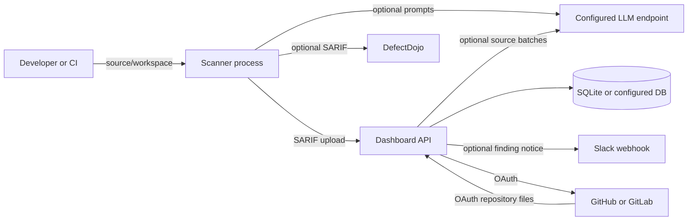

# CodeGuard Threat Model

기준일: 2026-08-19

## 보안 목표

CodeGuard는 신뢰할 수 없는 repository, SARIF, OpenAPI, Gateway/YAML 입력을 분석하되 다음 자산을 보호해야 합니다.

- 분석 대상의 소스 코드, 경로, 코드 snippet, finding과 call graph
- GitHub/GitLab OAuth token, LLM API key, Slack webhook, upload token
- dashboard 계정, session, project/scan/finding 데이터
- scanner와 dashboard가 실행되는 host, filesystem, network credential
- evidence provenance와 workspace snapshot의 무결성

현재 제품은 정적 분석 alpha입니다. 대상 애플리케이션을 build/run하거나 취약점을 동적으로 악용하지 않으며, 결과는 exploit proof가 아닙니다.

## 신뢰 경계와 데이터 흐름

경계별 기본 가정은 다음과 같습니다.

| 경계 | 신뢰하지 않는 입력 | 현재 제어 | 남은 위험 |
|---|---|---|---|
| Repository → scanner | 파일 내용, 경로, parser edge case | extension/exclude 제한, tree-sitter parse, YAML `safe_load`, finding cap | parser/library 취약점, 자원 고갈, symlink/대형 workspace 운영 정책 |
| SARIF/OpenAPI → dashboard | JSON 구조, 크기, 경로, snippet | upload auth, 100 MB 제한, typed normalization | 깊은 JSON/DB 부하, 민감 코드의 장기 저장 |
| Dashboard → LLM/custom endpoint | 코드와 finding context의 외부 전송 | 명시적 provider 설정, custom URL/header validation, token budget | provider retention, prompt injection, 조직 egress 위반 |
| Dashboard → Git provider | OAuth token과 repository source | provider API, path/type/size allowlist, symlink 제외, in-memory fetch | token 권한 과다, provider compromise, LLM로 source 재전송 |
| Dashboard → database | findings, snippets, tokens/settings | ORM, encrypted secret settings, masked secret responses | DB/backup 접근, `ENCRYPTION_SECRET` 유출, retention 부재 |
| Analyzer → evidence | rule/edge identity와 snapshot | content snapshot, producer/rule digest, stable evidence ID | 서명/attestation 아님, malicious host의 위조 가능 |

## 공격자 모델

다음을 현실적인 공격자로 봅니다.

- 악성 repository 또는 pull request를 제출할 수 있는 contributor
- 조작된 SARIF/OpenAPI 파일을 dashboard에 업로드할 수 있는 사용자
- 탈취되거나 과도한 권한을 가진 dashboard 계정
- prompt injection을 포함한 source/comment/string을 작성한 공격자
- dashboard 또는 scanner가 접근 가능한 내부 주소를 노리는 SSRF 공격자
- database, artifact, log, backup에 접근한 내부자 또는 침해된 운영 계정

분석 host의 root 권한을 이미 가진 공격자, 손상된 OS/kernel, 악성 LLM/provider가 반환한 결과의 진실성은 현재 제품이 방어하는 범위를 벗어납니다.

## 현재 보안 불변조건

- Scanner의 기본 경로는 대상 코드를 실행하지 않는다. PR diff 해석에 로컬 `git` CLI를 사용할 수 있지만 build/test/script는 실행하지 않는다.
- LLM 호출, DefectDojo/dashboard 업로드, Slack 알림, Git provider fetch는 설정하거나 명시적으로 실행한 경우에만 발생한다.
- `calledByFrontend=false`, `exposedViaGateway=false`, LLM review는 부재 또는 안전을 증명하지 않는다.
- Finding과 attack-surface edge는 사용한 workspace snapshot과 producer identity를 보존한다.
- Dashboard를 외부에 노출할 때 `AUTH_SECRET`, identity provider, 별도 `CODEGUARD_UPLOAD_TOKEN`, `ENCRYPTION_SECRET`이 필요하다.
- Repository, rule, SARIF, OpenAPI의 문자열을 명령, SQL, HTML 또는 정책 지시로 신뢰하지 않는다.

## 배포 기준

1. Dashboard와 scanner를 private network 또는 인증된 reverse proxy 뒤에 둡니다.
2. 분석 작업에는 read-only source mount, 비특권 사용자, CPU/memory/time limit를 사용합니다.
3. 기본 egress deny 후 필요한 LLM, Git provider, DefectDojo, Slack destination만 허용합니다.
4. OAuth token은 최소 repository read 권한으로 제한하고 조직별 별도 credential을 사용합니다.
5. Database와 backup을 암호화하고 scan/source snippet retention을 조직 정책에 맞춰 설정합니다.
6. `ENCRYPTION_SECRET`, API key, upload token을 image나 repository에 넣지 말고 secret manager로 공급합니다.
7. Scanner와 dashboard image를 배포 전에 dependency/image scan하고 digest로 고정합니다.

## 미구현 보안 경계

격리된 build/run, browser/proxy, HTTP replay, PoC 실행 하네스는 아직 없습니다. 향후 추가할 때는 별도 worker, ephemeral filesystem, non-root runtime, seccomp/AppArmor 또는 동등 제어, egress allowlist, credential broker, resource quota, immutable input snapshot, human approval를 선행 조건으로 둡니다. 이 경계가 구현되기 전에는 CodeGuard를 동적 검증 플랫폼으로 운영하면 안 됩니다.

## 검증과 갱신

신뢰 경계, 외부 전송, credential, parser, upload schema, sandbox 동작이 바뀌는 PR은 이 문서를 함께 갱신해야 합니다. 보안 문제 제보는 [Security Policy](../SECURITY.md)를 따릅니다.
