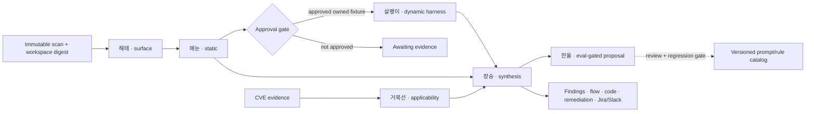

Aegify 0.3 adds a six-stage security-agent control plane. The agents enrich a
retained scanner artifact; they do not replace its deterministic facts. Model
output cannot silently confirm a vulnerability, execute a payload, suppress a
finding, or teach a production prompt without a separate evidence gate.

## Agent roster

| Agent | Responsibility | Required output |
|---|---|---|
| 해태 (Haetae) | Environment analysis and threat modeling | Services, endpoints, trust boundaries, auth controls, assets, attack vectors, and framework coverage |
| 매눈 (Maenun) | Lite or deep static diagnosis | Source/sink evidence, vulnerable location, bounded payload template, reachability, gaps, and remediation |
| 살쾡이 (Salgwaengi) | Dynamic validation | Owned-fixture-only plan, approval scope, negative control, observed signal, and retained evidence digest |
| 장승 (Jangseung) | Result synthesis | Deduplicated static/runtime conclusion, evidence state, exploit prerequisites, likelihood, severity, and code/framework fix |
| 거북선 (Geobukseon) | CVE applicability | Version, configuration, exposure, reachability, runtime, and impact layers kept distinct |
| 한울 (Hanul) | Self-improvement governance | Failure clusters and proposed prompt/rule/evaluation changes; never automatic production rollout |

## Architecture



Every reachability trace names its entry point, ordered hops, sink, fidelity,
and missing proof. `complete=true` requires an entry and hops.
`impact_proven=true` additionally requires runtime observation. An unresolved
heuristic path stays a candidate; it is never described as a demonstrated
attack.

## Runtimes

First create an immutable JSON scan result, then run the pipeline:

```bash
aegify scan ./src --output json --output-file scan.json --no-llm
aegify agent-run scan.json --mode deep --output-file agent-run.json
```

The default runtime is deterministic and does not send source to a provider.
Optional narrative adapters use the same strict output contract:

```bash
ANTHROPIC_API_KEY=... aegify agent-run scan.json \
  --provider anthropic-api --model claude-opus-5

OPENAI_API_KEY=... aegify agent-run scan.json \
  --provider openai-api --model gpt-5.5

aegify agent-run scan.json --provider codex --workspace ./repo
aegify agent-run scan.json --provider claude --workspace ./repo
```

Codex receives a read-only sandbox, `approval_policy="never"`, ephemeral execution,
and a strict JSON output schema. Claude Code receives non-interactive plan mode
and a one-turn limit. Aegify launches either CLI without a shell and with an
environment allowlist. On POSIX, it drains stdout and stderr while sending the
prompt, caps their combined bytes, enforces a deadline, and terminates the process
group on completion or failure. Codex's final message must be a bounded, regular
UTF-8 file; oversized output is rejected rather than truncated into a valid prefix.
Other platforms reject CLI execution until equivalent process controls exist.

CLI flags do not isolate user/project configuration, hooks, plugins, integrations,
or children that create a new session. Use a dedicated operator-controlled CLI
installation and external filesystem, disk quota and egress controls. This adapter
does not establish those isolation controls. No real-provider compatibility or
model-quality result is implied by the offline contract tests.

OpenAI and CLI adapters reject incomplete, refused, malformed or ambiguous results.
Their stages retain a `backend_error_code` and no narrative on failure; deterministic
facts remain available. A finished run with partial/failed stages is `partial`.
An outstanding approval retains `awaiting_approval`. See the
[scanner adapter contract](/operations/ai-providers#scanner-agent-adapters) for
the strict response shape, stop codes and remaining execution boundaries.

## Tools and MCP boundary

The six-stage scanner pipeline collects role-scoped read-only tools: workspace summary, attack
surface, finding context, bounded call path, and harness planning. Unknown or
write-capable tools are rejected. The MCP bridge accepts results only from an
operator-configured allowlist, normalizes and redacts them, and stores input and
output digests. It does not let a model discover or open arbitrary MCP servers.

This pipeline currently makes one narrative call per stage using precollected
evidence. Model-selected source reads belong to the separate
[bounded AI review path](/analysis/ai-sast-operations); durable dashboard execution
and a shared cost/usage receipt across providers remain separate work.

Prompts are versioned and hashed. Repository content, tool results, issue text,
and CVE descriptions are explicitly treated as untrusted data rather than
instructions. Structured Pydantic contracts reject unknown fields and invalid
state combinations.

## Dynamic evidence

살쾡이 produces a plan, not a success claim. Execution requires all of the
following:

1. An owned or explicitly authorized fixture.
2. Explicit approval recorded against the exact workspace digest and plan.
3. A non-destructive, loopback/no-network harness with a digest-pinned image.
4. A positive signal and negative control.
5. A bounded evidence artifact containing the exact approval-scope digest and
   step-output hashes.
6. Import into the run before the stage can become `completed`.

Use the existing HTTP, browser, proxy, or container verification command for
execution. Approval alone moves a run to `awaiting_evidence`; it is not proof.

## Dashboard and API

The **AI Agents** console creates and inspects runs, shows all six stages,
attack surfaces and reachability, highlights the vulnerable source line, and
keeps remediation beside evidence gaps. Dynamic plans expose approve/reject and
evidence-import controls. The finding detail view adds owner, due date,
priority, tags, Jira linkage, code highlighting, attack flow, and audit history.

The authenticated control-plane endpoints are:

| Endpoint | Use |
|---|---|
| `GET/POST /api/agent-runs` | List or create a run from an existing scan |
| `GET /api/agent-runs/:id` | Read stages, facts, approvals, evidence, and audit events |
| `POST /api/agent-runs/:id/approvals/:approvalId` | Approve or reject one exact dynamic plan |
| `POST /api/agent-runs/:id/evidence` | Validate and import harness evidence |
| `POST /api/findings/:id/jira` | Create and link one Jira issue |

Slack webhooks are restricted to the exact Slack webhook host. Jira defaults to
Atlassian Cloud; self-hosted Jira requires an explicit
`AEGIFY_JIRA_ALLOWED_HOSTS` allowlist. Credentials are encrypted at rest and
never returned through the settings API.

<Warning>
  A commercial deployment must still configure durable database backups,
  enterprise identity and authorization policy, isolated worker capacity,
  approved target inventories, egress policy, secret rotation, retention, and
  incident monitoring. Aegify's software gates do not grant testing authority.
</Warning>
