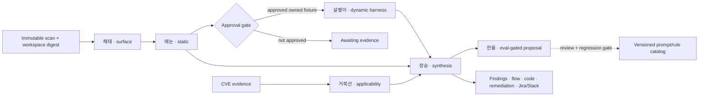

Aegify 0.3 adds a six-stage security-agent control plane. The agents enrich a
retained scanner artifact; they do not replace its deterministic facts. Model
output cannot silently confirm a vulnerability, execute a payload, suppress a
finding, or teach a production prompt without a separate evidence gate.

## Agent roster

| Agent | Responsibility | Required output |
|---|---|---|
| 해태 (Haetae) | Environment analysis and threat modeling | Services, endpoints, trust boundaries, auth controls, assets, attack vectors, and framework coverage |
| 매눈 (Maenun) | Lite or deep static diagnosis | Source/sink evidence, vulnerable location, bounded payload template, reachability, gaps, and remediation |
| 살쾡이 (Salgwaengi) | Dynamic validation | Owned-fixture-only plan, approval scope, negative control, observed signal, and retained evidence digest |
| 장승 (Jangseung) | Result synthesis | Deduplicated static/runtime conclusion, evidence state, exploit prerequisites, likelihood, severity, and code/framework fix |
| 거북선 (Geobukseon) | CVE applicability | Version, configuration, exposure, reachability, runtime, and impact layers kept distinct |
| 한울 (Hanul) | Self-improvement governance | Failure clusters and proposed prompt/rule/evaluation changes; never automatic production rollout |

## Architecture



Every reachability trace names its entry point, ordered hops, sink, fidelity,
and missing proof. `complete=true` requires an entry and hops.
`impact_proven=true` additionally requires runtime observation. An unresolved
heuristic path stays a candidate; it is never described as a demonstrated
attack.

## Runtimes

First create an immutable JSON scan result, then run the pipeline:

```bash
aegify scan ./src --output json --output-file scan.json --no-llm
aegify agent-run scan.json --mode deep --output-file agent-run.json
```

The default runtime is deterministic and does not send source to a provider.
Optional narrative adapters use the same strict output contract:

```bash
ANTHROPIC_API_KEY=... aegify agent-run scan.json \
  --provider anthropic-api --model claude-opus-5

OPENAI_API_KEY=... aegify agent-run scan.json \
  --provider openai-api --model gpt-5.5

aegify agent-run scan.json --provider codex --workspace ./repo
aegify agent-run scan.json --provider claude --workspace ./repo
```

Codex receives a read-only sandbox, `approval_policy="never"`, ephemeral execution,
and a strict JSON output schema. Claude Code receives non-interactive plan mode
and a one-turn limit. Aegify launches either CLI without a shell and with an
environment allowlist. On POSIX, it drains stdout and stderr while sending the
prompt, caps their combined bytes, enforces a deadline, and terminates the process
group on completion or failure. Codex's final message must be a bounded, regular
UTF-8 file; oversized output is rejected rather than truncated into a valid prefix.
Other platforms reject CLI execution until equivalent process controls exist.

CLI flags do not isolate user/project configuration, hooks, plugins, integrations,
or children that create a new session. Use a dedicated operator-controlled CLI
installation and external filesystem, disk quota and egress controls. This adapter
does not establish those isolation controls. No real-provider compatibility or
model-quality result is implied by the offline contract tests.

API and CLI adapters reject incomplete, refused, malformed or ambiguous results.
Their stages retain a `backend_error_code` and no narrative on failure; deterministic
facts remain available. A finished run with partial/failed stages is `partial`.
An outstanding approval retains `awaiting_approval`. See the
[scanner adapter contract](/operations/ai-providers#scanner-agent-adapters) for
the strict response shape, stop codes and remaining execution boundaries. Anthropic
agent artifacts now retain bounded per-role call receipts and reported native usage.
Their monetary cost remains unknown. Other providers currently expose no shared
usage accounting; a null receipt summary must not be interpreted as zero spend.

## Tools and MCP boundary

The six-stage scanner pipeline collects role-scoped read-only tools: workspace summary, attack
surface, finding context, bounded call path, and harness planning. Unknown or
write-capable tools are rejected. The MCP bridge accepts results only from an
operator-configured allowlist, normalizes and redacts them, and stores input and
output digests. It does not let a model discover or open arbitrary MCP servers.

Without `--source-tools`, this pipeline makes one narrative call per stage using
precollected evidence. With `--source-tools`, each role can select its next tool,
inspect the result, and request more source before returning a narrative.

### Source exploration from a saved scan

Create the scan with a version that records per-file content hashes:

```bash
aegify scan ./repo --output json --output-file scan.json --no-llm
aegify agent-run scan.json --provider openai-api --model gpt-5.5 \
  --workspace ./repo --source-tools --max-agent-rounds 4 --max-agent-tools 12 \
  --output-file agent-run.json
```

For a workspace scan, bind each repository ID from `analyzed_sources` explicitly.
The checkout can move between scan and review jobs:

```bash
aegify agent-run workspace-scan.json --provider anthropic-api \
  --source-tools --source-root api=./checkouts/api --source-root web=./checkouts/web \
  --output-file agent-run.json
```

Single-repository scans use the `local` ID and default to `--workspace` as their
source root. The scanner reads only admitted, repository-relative files whose
language and content hash match the saved scan. Historical absolute paths never
select reads. Symlinks, hidden paths, changed files, duplicate identities and
unbound legacy records are unavailable. The retained catalog is immutable;
subsequent tool calls use its redacted in-memory content. These hashes bind the
contents of a trusted scan artifact; they do not authenticate its publisher.

All six roles can request `source_list_files`, `source_search` and `source_read`,
plus their existing role-scoped metadata tools. A search is literal, not executable
code or a regular expression. Symbol indexes are not retained in saved scans, so
this loop does not offer `source_symbols`. The broker runs no shell, network request
or reviewed application. Dynamic and CVE roles can inspect source and existing
evidence, but this loop cannot run their validation plans.

Default limits per role are four model-call attempts, twelve tool requests
(including cache hits), four requests per turn, 128 KiB of prompt material per
call, 96 KiB of retained tool-result material and 64 KiB per structured reply.
The final allowed round must return a narrative. Identical successful tool requests
within a stage reuse evidence. The six-role maximum is therefore 24 model-call
attempts by default; this is a call bound, not a token or monetary budget.
Anthropic additionally enforces the configured shared token/call budget.

Each stage's `exploration` retains the scan and source-manifest digests, source
omission counts, configured limits, per-round input/output digests and duration,
redacted tool arguments/results, cache use and selected source citations.
Only citations issued by successful, untruncated reads/searches in that stage are
accepted. Static and synthesis stages also report which finding locations are
covered. Missing/forged citations, uncovered findings, catalog gaps and exhausted
limits make the review partial. A valid citation identifies source that was read;
it does not independently verify the model's claim or establish runtime impact.

The API, Codex and Claude Code adapters carry the same iterative JSON contract.
Native CLI configuration and isolation still require the controls described above:
broker restrictions do not confine a CLI's inherited tools or integrations.
Offline tests use scripted API transports and owned inert CLI programs, not live
model services. Anthropic retains reported usage; other provider accounting and
all monetary cost remain unverified.

This flag currently applies to the scanner CLI. It does not replace the dashboard
six-role worker or the separate [bounded finding review path](/analysis/ai-sast-operations).
The CLI writes its artifact at the end and returns exit code `3` for partial review
or pending approval. It does not provide durable per-turn checkpoints or automatic
crash replay; retain the output as a CI artifact and inspect gaps before rerunning.

Prompts are versioned and hashed. Repository content, tool results, issue text,
and CVE descriptions are explicitly treated as untrusted data rather than
instructions. Structured Pydantic contracts reject unknown fields and invalid
state combinations.

## Dynamic evidence

살쾡이 produces a plan, not a success claim. Execution requires all of the
following:

1. An owned or explicitly authorized fixture.
2. Explicit approval recorded against the exact workspace digest and plan.
3. A non-destructive, loopback/no-network harness with a digest-pinned image.
4. A positive signal and negative control.
5. A bounded evidence artifact containing the exact approval-scope digest and
   step-output hashes.
6. Import into the run before the stage can become `completed`.

Use the existing HTTP, browser, proxy, or container verification command for
execution. Approval alone moves a run to `awaiting_evidence`; it is not proof.

## Dashboard and API

The **AI Agents** console creates and inspects runs, shows all six stages,
attack surfaces and reachability, highlights the vulnerable source line, and
keeps remediation beside evidence gaps. Dynamic plans expose approve/reject and
evidence-import controls. The finding detail view adds owner, due date,
priority, tags, Jira linkage, code highlighting, attack flow, and audit history.

The authenticated control-plane endpoints are:

| Endpoint | Use |
|---|---|
| `GET/POST /api/agent-runs` | List or create a run from an existing scan |
| `GET /api/agent-runs/:id` | Read stages, facts, approvals, evidence, and audit events |
| `POST /api/agent-runs/:id/approvals/:approvalId` | Approve or reject one exact dynamic plan |
| `POST /api/agent-runs/:id/evidence` | Validate and import harness evidence |
| `POST /api/findings/:id/jira` | Create and link one Jira issue |

Slack webhooks are restricted to the exact Slack webhook host. Jira defaults to
Atlassian Cloud; self-hosted Jira requires an explicit
`AEGIFY_JIRA_ALLOWED_HOSTS` allowlist. Credentials are encrypted at rest and
never returned through the settings API.

<Warning>
  A commercial deployment must still configure durable database backups,
  enterprise identity and authorization policy, isolated worker capacity,
  approved target inventories, egress policy, secret rotation, retention, and
  incident monitoring. Aegify's software gates do not grant testing authority.
</Warning>
